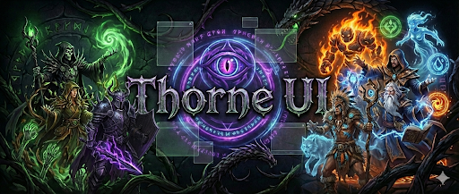

# Thorne UI

Custom UI files for **TAKP Quarm Server** (The Al'Kabor Project, PoP-era EverQuest). Originally based on the **QQQuarm mod**, now evolved into a standalone, documented UI suite focused on usability and maintainability.

---

## 🎯 Project Vision

**Thorne UI** provides modern, accessible user interface customizations for TAKP that respect classic EverQuest aesthetics while improving usability and visual clarity. The project emphasizes:

- **Consistency** - Unified standards across all windows and variants
- **Readability** - Larger slots, clearer labels, appropriate spacing
- **Flexibility** - Multiple variants for different playstyles and preferences
- **Maintainability** - Clear documentation and coding standards for future updates
- **Accessibility** - Well-organized tools and logical window layouts

---

## 📋 Project Philosophy

### Design Principles

1. **Responsive Layout** - Windows scale proportionally while maintaining usability
2. **Clear Hierarchy** - Primary information is prominent, secondary information is accessible
3. **Consistent Spacing** - Standardized margins, padding, and alignment across all windows
4. **Color Semantics** - Colors convey meaning (e.g., purple for pet HP, blue for mana)
5. **Legacy Compatibility** - Respects classic EverQuest UI conventions when appropriate

### Development Standards

All updates follow documented standards to maintain consistency. See [STANDARDS.md](.docs/STANDARDS.md) for complete guidelines on window sizing, button layouts, gauge styling, color palette, and EQType bindings.

---

## 📁 UI Variations

### 🔧 thorne_drak

**Gameplay-Focused UI Design** - Inspired by actual gameplay experience and built for 1920x1080 resolution and larger. Designed to keep all critical information visible and accessible at all times.

**Design Philosophy:**

- **Always-Visible Information** - Player stats, health, mana, experience visible without opening windows
- **Multi-Purpose Windows** - Morph existing EverQuest windows to serve multiple functions with smart tabbing
- **Quick Access Everywhere** - Key information duplicated intelligently across multiple windows for efficiency
- **Action-Ready Layout** - Combat stats, buffs, pet info, target info all accessible without clutter
- **Expandable Resolution Support** - Optimized for 1920x1080 and larger for maximum visibility

**Key Features:**

- Tabbed windows providing quick access to different information types
- Expanded slot sizing (45x45px standard) for easy clicking
- Redesigned merchant/loot grids (5-column, vertical-scroll) with better visibility
- Horizontal bag layout for inventory with full visual feedback
- Extensive Options folder with alternate layouts for different playstyles
- Player window showing stats, indicators, and quick reference information
- Pet window with controls, health, and mana always visible
- Group window optimized for raid visibility

**Best For:** Players who value always-visible information, quick access to stats and buffs, and well-organized multi-functional windows

> **Note:** thorne_drak is the active development variant. Previous experimental variants (thorne_duxa, thorne_infiniti, thorne_qq) have been consolidated. For reference implementations, see the community UIs: duxaUI, Infiniti-Blue, QQQuarm

---

## 🙏 Credits & Inspiration

- **Origin**: QQQuarm mod and its contributors (foundation and early layout concepts)
- **Inspiration**: Nillipuss UI (feature ideas and polish targets for upcoming releases)
- **Community references**: DuxaUI, Infiniti-Blue, QQ/QQQuarm, vert, zeal, and default UI files
- **Custom work**: Layouts, documentation, and custom textures maintained by **Draknare Thorne**

---

## 💾 Installation

### From GitHub Releases (Recommended)

1. **Download** - Visit the [Releases page](https://github.com/draknarethorne/thorne-ui/releases) and download `thorne_drak`
2. **Extract** - Unzip the downloaded file to `<TAKP Install>/uifiles/`
3. **Load in-game** - Use command: `/loadskin thorne_drak`
4. **Reload** - UI will automatically refresh with new skin

### From Source

1. **Clone/Download** - Get the repository source code
2. **Copy** - Place desired `thorne_*` directory in `<TAKP Install>/uifiles/`
3. **Load in-game** - Use command: `/loadskin thorne_drak` (or other variant)
4. **Reload** - UI will automatically refresh with new skin

---

## ⚙️ Technical Details

| Property | Value |
|----------|-------|
| **Format** | SIDL XML (Sony Interface Description Language) |
| **Platform** | TAKP (Planes of Power 2002 emulation) |
| **Editor** | Any text editor; no compilation needed |
| **Scripting** | Pure declarative layout - no scripting support |
| **Fonts** | Global numbered references affect entire UI |

### Key Components

| Component | Purpose |
|-----------|---------|
| `<Screen>` | Top-level window container |
| `<Gauge>` | Progress bars bound to game data (HP, Mana, XP) |
| `<Label>` | Text displays (static or EQType-bound) |
| `<Button>` | Interactive controls with standard styling |
| `<ListBox>` | Scrollable item lists (inventory, spell books) |
| `<StaticAnimation>` | Background images and decorative elements |

---

## ✅ Current Focus (v0.7.0)

We are implementing the first **stat-icons and combat feature set**, inspired by Nillipuss concepts but adapted to Thorne’s standards:

- Spell recast timers (global + per-gem)
- Resistance icons in Actions window
- Target spell casting name
- Target attack delay timer
- Spellbook meditate button

**Roadmap & analysis**: See the [UI Analysis Hub](.development/ui-analysis/README.md) for the full feature index, priorities, and future phases.

---

## 📚 Documentation Structure

This project maintains comprehensive documentation organized by purpose:

- **[STANDARDS.md](.docs/STANDARDS.md)** - UI development standards, button layouts, gauge styling, color palette, EQType reference, and contributing guidelines
- **[DEVELOPMENT.md](DEVELOPMENT.md)** - Implementation guide, workflow, architecture decisions, development roadmap (phases 1-7), and technical reference
- **[TODO.md](TODO.md)** - Planned features, work items, and ongoing investigations organized by category
- **[UI Analysis Hub](.development/ui-analysis/README.md)** - Comprehensive Nillipuss vs Thorne analysis and roadmap
- **Individual window docs** - Some windows have dedicated `EQUI_*.md` files with detailed notes and history (in `thorne_drak/`)

### Quick Links

- **Starting development?** → Read [DEVELOPMENT.md](DEVELOPMENT.md) for workflow and architecture
- **Need UI standards?** → See [STANDARDS.md](.docs/STANDARDS.md) for all guidelines
- **Planning work?** → Check [TODO.md](TODO.md) for priorities and status
- **Need feature roadmap?** → Start at [UI Analysis Hub](.development/ui-analysis/README.md)
- **Contributing?** → Follow guidelines in [.docs/STANDARDS.md](.docs/STANDARDS.md)

---

## 🔧 Getting Started

### Development Workflow

1. **Copy project** to your development folder
2. **Edit XML files** directly with any text editor
3. **Test changes** in-game with `/loadskin thorne_drak`
4. **Commit changes** with clear messages explaining modifications

### Before Committing

- ✅ Test all changes in-game
- ✅ Verify no overlapping elements or visual glitches
- ✅ Maintain consistent spacing and alignment
- ✅ Follow established standards (see [.docs/STANDARDS.md](.docs/STANDARDS.md))
- ✅ Add comments for non-obvious decisions
- ✅ Document changes in commit message

### Creating a Release

Releases are created automatically through GitHub Actions when you push a version tag:

```bash
# 1. Update version in README.md (Version History section)
# 2. Commit and push all changes
git add .
git commit -m "Prepare for release v0.6.5"
git push origin main

# 3. Create and push a version tag (triggers automated workflow)
git tag -a v0.6.5 -m "Release v0.6.5: Spellbook/cast polish and Thorne option sync improvements"
git push origin v0.6.5

# 4. GitHub Actions automatically:
#    ✅ Creates ZIP packages (thorne_drak-v0.6.5.zip)
#    ✅ Generates changelog from commits
#    ✅ Publishes to Releases page
#    ✅ Makes downloads available
```

**📚 Detailed Instructions:**
- **Quick Start:** [.docs/releases/RELEASES-QUICKSTART.md](.docs/releases/RELEASES-QUICKSTART.md) - Fast reference for creating releases
- **Complete Guide:** [.docs/releases/RELEASES.md](.docs/releases/RELEASES.md) - Full documentation with troubleshooting
- **FAQ:** [.docs/releases/RELEASES-FAQ.md](.docs/releases/RELEASES-FAQ.md) - Common questions answered

**🔗 View Releases:** https://github.com/draknarethorne/thorne-ui/releases

---

## 📦 Window Options & Variants

Each UI variant includes an **Options** directory with alternative window configurations and styling choices. This allows you to customize your experience without manually editing XML files.

### Options Directory (Sample Structure)

```
thorne_drak/
├── EQUI_PlayerWindow.xml      (main windows in root)
├── EQUI_Inventory.xml
├── Options/                   (alternative layouts and configurations)
│   ├── Player/
│   │   ├── Standard/
│   │   │   ├── EQUI_PlayerWindow.xml
│   │   │   └── README.md
│   │   └── ...more layouts as added
│   ├── Merchant/
│   ├── Actions/
│   ├── Hotbutton/
│   ├── Gauges/
│   │   ├── gauge_pieces01.tga    (shared texture assets)
│   │   ├── gauge_pieces02.tga
│   │   └── README.md             (gauge documentation)
│   └── ...more as they're added
```

**File Types You'll Find:**
- **`EQUI_*.xml`** - Window definition files (copy to replace main window)
- **`README.md`** - Documentation explaining the variant/option (how to use, what changed)
- **`*.tga`** - Texture/image files used by windows (e.g., gauge pieces, backgrounds, icons)

*Note: Exact structure evolves over time as new options are created. Check the actual `Options/` directory for current offerings.*

### How to Use Window Options

1. **Browse available options** - Check `thorne_drak/Options/` directory for alternatives
2. **Read the documentation** - Each folder has a `README.md` with descriptions
3. **Test different layouts** - Try swapping `EQUI_*.xml` files to see different configurations
4. **Handle texture files** - If an option includes custom `.tga` files, copy them to your variant root
5. **Reload in-game** - Use `/loadskin thorne_drak 1` to see changes

### Example: Trying Different Player Window Layouts

- Main `EQUI_PlayerWindow.xml` contains the default layout
- Alternative layouts are in `Options/Player/` subfolders
- Each folder has its own `EQUI_PlayerWindow.xml` and possibly custom textures
- Test different options to find what works best for your playstyle

### Creating Your Own Options

When you modify a window:

1. **Test the main version** thoroughly
2. **Create a subfolder** in `Options/YourWindow/` (e.g., `MyCustomLayout/`)
3. **Copy your modified** `EQUI_WindowName.xml` into your folder
4. **Include custom textures** - Copy any `.tga` files your option uses
5. **Document your changes** with a `README.md` file

---

## 🎨 Creating Variants & Options

Want to create your own UI variant? Follow these steps:

1. Copy `thorne_drak` to new directory: `thorne_yourname`
2. Modify XML files while respecting established standards
3. Test thoroughly in-game
4. Document your changes and design decisions
5. Consider contributing back for inclusion in main project

### Organizing Your Custom Options

As you modify windows, keep them organized:

1. Keep your main files in the variant root
2. Store alternative layouts in `Options/YourWindow/LayoutName/`
3. Document each option with a `README.md` file
4. This structure makes it easy to switch between layouts

See [.docs/STANDARDS.md](.docs/STANDARDS.md) for standards and [DEVELOPMENT.md](DEVELOPMENT.md) for architecture decisions.

---

## 🚀 Road to v1.0.0

All v0.x.x releases are **alpha/beta** versions building toward a stable v1.0.0 release. Track our progress:

### Milestone Status

| Category | Open Issues | Status |
|----------|-------------|--------|
| **Epics** | [#8](https://github.com/draknarethorne/thorne-ui/issues/8), [#12](https://github.com/draknarethorne/thorne-ui/issues/12), [#15](https://github.com/draknarethorne/thorne-ui/issues/15) | In Progress |
| **High Priority** | [#17](https://github.com/draknarethorne/thorne-ui/issues/17) | Ready |
| **Architecture** | [#14](https://github.com/draknarethorne/thorne-ui/issues/14), [#16](https://github.com/draknarethorne/thorne-ui/issues/16) | Planning |
| **Polish** | [#9](https://github.com/draknarethorne/thorne-ui/issues/9), [#11](https://github.com/draknarethorne/thorne-ui/issues/11), [#13](https://github.com/draknarethorne/thorne-ui/issues/13), [#26](https://github.com/draknarethorne/thorne-ui/issues/26) | Backlog |

### Key Epics for 1.0.0

- **[Stat Icons Integration](https://github.com/draknarethorne/thorne-ui/issues/8)** - Option-driven stat icon layouts (text/icons/both)
- **[UI Standards Investigation](https://github.com/draknarethorne/thorne-ui/issues/12)** - Standardize patterns from community UIs
- **[Spellbook & Spell Gems](https://github.com/draknarethorne/thorne-ui/issues/15)** - Icon consistency and sizing improvements

### Links

- **[All Open Issues](https://github.com/draknarethorne/thorne-ui/issues)** - Current work items
- **[Pull Requests](https://github.com/draknarethorne/thorne-ui/pulls)** - Active development
- **[Releases](https://github.com/draknarethorne/thorne-ui/releases)** - Download latest versions

---

## 📅 Version History

**v0.6.5** (February 18, 2026)
- ✅ Spellbook and casting UI polish
  - Spellbook promoted to readability-first Thorne baseline
  - Restored standard 84x20 Done button sizing to match Inventory standards
  - Cast window Spellbook button standardized to 20px height with adjusted window spacing
- ✅ Options system migration to Thorne-first variants
  - Window option baselines migrated from `Default/` to `Thorne/` where applicable
  - Added dedicated Thorne sync tooling for window option backups and metadata updates
  - Added `sync-option-thorne.bat` wrapper for maintainable Windows-native sync workflow
- ✅ Icon and variant refresh
  - Regenerated gem icon packs across option themes and root assets
  - Updated option metadata/readmes to match current Thorne workflow

**v0.6.4** (February 15, 2026)
- ✅ Gauge system overhaul
  - Size-specific gauge textures and animations (tall/wide variants)
  - Wide gauge support and line rendering improvements
  - Consistent gauge colors and alignment across Player, Pet, Inventory, and Spellbook
- ✅ Target window improvements
  - Added attack tick gauge (combat timer test)
  - Added casting spell name display with refined layout
  - Improved target HP/casting section spacing and background alignment
- ✅ Tooling updates
  - Gauge regeneration and audit scripts
  - Release/label utility scripts and documentation cleanup

**v0.6.3** (February 9, 2026) _(pre-release)_
- ✅ Cast spell window spell-name font adjusted to Font 1

**v0.6.2** (February 9, 2026) _archived_
- ✅ Inventory equipment grid refinements
  - Restored Hands slot visibility and sizing
  - Converted layout to 6-row anatomical “paper doll” arrangement
  - Centered 3-slot rows for cleaner alignment
- ✅ Class animation and progression layout tuning
  - ClassAnim window repositioned and resized with preserved aspect ratio
  - Progression window height reduced to balance layout
- ✅ Loadskin window width expansion (+32px)
- ✅ New Options variants for Inventory (Default + Enhanced No Hands Bug)

**v0.6.1** (February 7, 2026) _archived_
- ✅ Attack Indicator now displays correctly in Player Window
- ✅ Recessed box visuals refined
  - Darker recessed background for better contrast
  - Size adjusted to 40x40 for improved alignment

**v0.6.0** (February 6, 2026)
- ✅ Phase 3.9: Inventory system redesign (final version)
  - Anatomical 4-column equipment layout (21 armor slots, 2px spacing)
  - Unified 45x45px slot sizing for consistency
  - Currency zone repositioned with proper spacing
  - Equipment grid positioned for visual clarity
- ✅ Attack Indicator texture fix (resolves UIError.txt and Texture.txt errors)
- ✅ Texture and XML encoding corrections
  - Converted mislabeled PNG files to proper TGA format
  - Fixed UTF-8 character encoding in us-ascii XML files
  - Corrected scrollbar_gutter.tga dimensions (0x0 → 16x16)
- ✅ Player window improvements across all variants
  - AttackIndicator animation properly defined
  - Gauge animations refactored and optimized
- ✅ Comprehensive texture validation (45 .tga files verified)

**v0.5.0** (February 3, 2026)
- ✅ Phase 5: Target Window enhancements (ToT, player gauges, target info)
- ✅ Pet window improvements (dismiss button, color updates)
- ✅ Comprehensive XML attribution headers (38 files)
- ✅ Loot window bug fix (proper 4×5 grid height)
- ✅ Enhanced Options documentation and variants
- ✅ Documentation reorganization (hidden .docs/ and .bin/ directories)
- ✅ Naming standardization across all documentation files

**v0.4.0** (February 2, 2026)
- ✅ GitHub Releases infrastructure with automated workflow
- ✅ Automated ZIP packaging triggered by version tags
- ✅ Release testing suite with validation script
- ✅ Comprehensive releases documentation (FAQ, guides, testing)
- ✅ Public Releases page for easy user downloads
- ✅ Automated changelog generation from commits

**v0.3.0** (February 1, 2026) _archived_
- ✅ Complete documentation reorganization (modular structure with .docs/ directory)
- ✅ Phase documentation extracted to individual files (9 phases)
- ✅ Technical references created (EQTypes, Zeal features)
- ✅ Enhanced STANDARDS.md with comprehensive patterns
- ✅ Merchant window comprehensive redesign (3-tab self-sufficient UI)
- ✅ Actions window resizable for collapsing inventory tabs
- ✅ Potion Belt reminder button added to Actions Main tab

**v0.2.0** (January 2026) _archived_
- ✅ Hybrid hotbar + inventory display (4-row layout)
- ✅ Vertical navigation arrows for multi-row hotbar
- 🔍 Discovered client hardcoding limitations (buttons 11-30 don't function)

**v0.1.0** (January 2026) _archived_
- ✅ Initial Actions window with inventory tabs
- ✅ Player stats integration
- ⚠️ Identified window fading limitation

---

## 📝 License

Custom UI for personal use with The Al'Kabor Project.

Maintainer: Draknare Thorne
