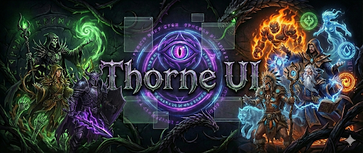

# Thorne UI

**The legendary UI for TAKP**—Crafted by Draknare Thorne, where classic EverQuest aesthetics meet modern playability.

Custom UI files for **TAKP Quarm Server** (The Al'Kabor Project, PoP-era EverQuest). Originally based on the **QQQuarm mod**, now evolved into a standalone, fully-documented UI suite focused on **usability, flexibility, and player choice**.

---

## 🎮 What Makes Thorne UI Special

**Thorne UI** respects classic EverQuest while making your gameplay better. We focus on:

- **Always Visible Information** - Keep your stats, health, and buffs accessible without window juggling
- **Player-First Design** - Multiple layout options for different playstyles; you choose how your UI looks
- **Quality Craftsmanship** - Consistent spacing, readable text, professional appearance
- **Easy Customization** - Pre-built Options variants let you swap layouts without editing XML
- **Playable, Not Flashy** - Clean, uncluttered interface that gets out of your way

### Your Data, Your Way

Every core window has **variants** to suit your preferences:

- **Standard layouts** - Tested and balanced defaults
- **Alternative options** - Tall/wide gauges, reorganized slots, custom colorways
- **Mix & match** - Use different variants for different windows
- **Extensible** - Documented and open for further customization

---

<!-- SCREENSHOT PLACEHOLDER: Full UI at 1920x1080 (include Player, Inventory, Spellbook, Buffs visible) -->
<!-- [Full UI Screenshot - Add tomorrow] -->

---

## 💾 Installation (2 Minutes)

### Option 1: Download Latest Release (Easiest)

1. Go to [Releases page](https://github.com/draknarethorne/thorne-ui/releases)
2. Download `thorne_drak-vX.X.X.zip`
3. Extract to `<TAKP Install>/uifiles/`
4. In-game: `/loadskin thorne_drak`

### Option 2: Use Source Code

1. Clone or download this repository
2. Copy `thorne_drak/` folder to `<TAKP Install>/uifiles/`
3. In-game: `/loadskin thorne_drak`

**You're done.** UI updates instantly in-game.

---

## 🎨 Core Features

### Window Layouts & Variants

**thorne_drak** - Our main variant, optimized for 1920x1080 and higher:

- **Player Window** - HP, mana, buffs, experience all at a glance
- **Inventory & Equip** - Large 45x45px slots, anatomical equipment layout for clarity
- **Spell Book** - Clear gem placement with recast timer support
- **Pet & Group** - Always-visible pet health/mana and raid member tracking
- **Merchant Window** - Shop without juggling inventory; fast scrolling with 5-column layout
- **Loot Window** - Large organized grid for quick looting
- **Chat & Buffs** - Customizable buff display, clear chat formatting

**Options for Every Window** - Don't like a layout? Try an alternative:

- Browse `thorne_drak/Options/` for pre-built variations
- Each option has a `README.md` explaining what's different
- Copy the option's XML file to the root to activate

See the [Options Guide](#-window-options--variants) below for details.

### Accessibility & Consistency

- **Readable Text** - Clear fonts, good contrast, no hidden information
- **Logical Layout** - Windows organized by information type
- **Consistent Spacing** - Standardized padding and alignment throughout
- **Color Semantics** - Colors mean something (e.g., red = HP, blue = mana)

<!-- SCREENSHOT PLACEHOLDER: Close-up of Player Window (show stat clarity and gauge design) -->
<!-- [Player Window Detail - Add tomorrow] -->

<!-- SCREENSHOT PLACEHOLDER: Inventory/Equipment (show anatomical layout) -->
<!-- [Equipment Layout - Add tomorrow] -->

---

## 🙏 Credits & Inspiration

This project builds on the work and ideas of many contributors:

- **QQQuarm mod** - Foundation and early layout concepts
- **Nillipuss UI** - Feature inspiration and quality targets
- **Community UIs** - DuxaUI, Infiniti-Blue, QQ, vert, zeal, and default UI files informed our design
- **TAKP Community** - Feedback and play-testing from eager players

**Maintained by**: Draknare Thorne

---

## ⚙️ For Developers & Contributors

### Want to customize Thorne UI?

- **Contributing Guidelines** - See [STANDARDS.md](.docs/STANDARDS.md)
- **Development Workflow** - See [DEVELOPMENT.md](.docs/DEVELOPMENT.md)
- **Architecture & Decisions** - See [DEVELOPMENT.md](.docs/DEVELOPMENT.md)
- **Roadmap & Priorities** - See [TODO.md](.docs/TODO.md)

### Creating Your Own Variant

1. Copy `thorne_drak/` to a new folder (e.g., `my_custom_ui/`)
2. Edit XML files with any text editor
3. Test in-game with `/loadskin my_custom_ui`
4. Document your changes (useful for you later!)
5. Consider contributing back to the project

For detailed standards and patterns, see [STANDARDS.md](.docs/STANDARDS.md).

---

## 📚 Documentation

This project includes comprehensive guides:

| Document                                  | Purpose                                                                      |
| ----------------------------------------- | ---------------------------------------------------------------------------- |
| [STANDARDS.md](.docs/STANDARDS.md)        | UI development standards, button layouts, gauge styling, EQType reference    |
| [DEVELOPMENT.md](.docs/DEVELOPMENT.md)          | Architecture, implementation guide, development roadmap, technical reference |
| [TODO.md](.docs/TODO.md)                        | Current work items, planned features, investigations                         |
| [RELEASES.md](.docs/releases/RELEASES.md) | How to create and publish releases                                           |

---

## 🔗 Quick Links

- 📥 **[Download Latest Release](https://github.com/draknarethorne/thorne-ui/releases)** - Get the newest version
- 📖 **[Full Documentation](.docs/DEVELOPMENT.md)** - Architecture, workflow, technical details
- 📋 **[Standards Guide](.docs/STANDARDS.md)** - UI development standards and patterns
- 🛠️ **[Roadmap & Issues](https://github.com/draknarethorne/thorne-ui/issues)** - What we're working on
- 💬 **[GitHub Discussions](https://github.com/draknarethorne/thorne-ui/discussions)** - Chat with the community

---

## 📦 Window Options & Variants

Most windows have **alternative layouts** available in the `Options/` directory. This lets you customize your experience without editing XML.

### Using Options

1. Navigate to `thorne_drak/Options/YourWindow/`
2. Read the variant's `README.md` to understand what's different
3. Copy the XML file to test (e.g., `Options/Player/Thorne/EQUI_PlayerWindow.xml` → `EQUI_PlayerWindow.xml`)
4. Reload with `/loadskin thorne_drak` to see changes in-game
5. If you like it, keep the option file. If not, revert to the original.

### Directory Structure

```
thorne_drak/
├── EQUI_PlayerWindow.xml      ← Main windows (active layout)
├── EQUI_Inventory.xml
├── Options/                   ← Alternative layouts
│   ├── Player/
│   │   ├── Thorne/
│   │   │   ├── EQUI_PlayerWindow.xml
│   │   │   └── README.md      ← Explains what's different
│   │   └── ...more as added
│   ├── Merchant/
│   ├── Inventory/
│   └── ...more windows
└── (textures, animations, config files)
```

Each option includes everything needed (XML + textures). Just copy the variant, test it, and commit if you like it.

### Creating Your Own Options

When you modify a window:

1. Create a folder in `Options/YourWindow/MyVariant/`
2. Copy your modified `EQUI_WindowName.xml` into it
3. Include any custom `.tga` texture files it needs
4. Write a `README.md` documenting what changed and why
5. Share it as a contribution!

---

## 🚀 Current Development (v0.8.0)

We're iterating toward **v1.0.0** with focused releases:

### Coming Up (v0.8.0)

- ⏳ **Multi-color health gauges** - 4 variants on MusicPlayerWnd, roll out to Player/Target/Group/Pet
- ⏳ **Enhanced group displays** - Analysis and implementation

### Future (v1.0.0)

- **Logo branding** - CharSelect, Inventory & key screens
- **Documentation pass** - 60 XML files, Options READMEs, registry docs
- **Release polish** - Field naming, button consistency, final QA

### Recent Releases

- **v0.7.5** - Class-specific slot art (15 classes × 7 themes), auto-tone, weapon archetype scoring
- **v0.7.4** - Container slot spacing, inventory logos, Thorne option sync
- **v0.7.3** - Logo atlas, tab icon branding, gauge polish
- **v0.7.0** - Spell recast timers, stat icons, Options modernization
- **v0.6.0** - Inventory redesign (Phase 3.9 completion)

**Want details?** See the [Full Version History](#-version-history) below or the [versioned roadmaps](.docs/).

---

## 📅 Version History

**v0.7.5** (March 10, 2026)

- ✅ Class-specific slot item overrides for 15 EQ classes
  - Built automated icon scoring pipeline: SQL extraction → stat-weighted scoring → icon selection
  - Class specificity multiplier, exclusivity bonus, confidence penalty for robust picks
  - Weapon archetype hints per class (Bard: blade primary/instrument secondary, Cleric: mace/shield, etc.)
  - Cross-slot deduplication across primary/secondary/range/ammo
  - Class-restricted item filtering on all equipment slots with relaxed fallback threshold
- ✅ Auto-tone gamma correction for Research atlas icons
  - Config-level `auto_tone: true` default with per-item override priority
  - Targets mean luminance 85–175 range for consistent icon readability
- ✅ Regenerated 112 slot combos (16 classes × 7 themes)
  - Each class uses archetype-typical armor, weapons, and accessories
  - Caster secondaries show orbs/wands/tomes, not shields
  - Bard instruments, Monk H2H, Rogue daggers — all class-appropriate
- ✅ Compact Master-style JSON formatter for Research config generation
- ✅ Promoted 15 class atlases from .Research/ to .Classes/ (production-ready)

**v0.7.4** (March 6, 2026)

- ✅ Container window slot spacing overhaul
  - Replaced compressed -1px overlap with proper 1px gap (41px step matching inventory feel)
  - Two-column layout: X=7/48 in 96px window, left-aligned for clean appearance
  - Combine button anchors realigned to slot grid width
  - Added Container option (Standard/Thorne variants)
- ✅ Inventory window branding
  - Added Thorne logo flanks at Ring equipment row (25×25 A_Logo_6)
  - Positioned at slot grid edges for subtle, balanced branding
- ✅ Target window layout refinements
- ✅ Thorne option sync across all categories
  - Synced logos and updates to Actions, Animations, Inventory, Target options
  - Updated sync metadata and option READMEs

**v0.7.3** (March 4, 2026)

- ✅ Logo atlas generation and branding system
  - Built `generate_thorne_logo_atlas.py` with 7 lighting modes (source, flat, radial_glow, radial_top_bias, bottom_light, top_light, rim_light)
  - JSON-driven config for atlas layout, transparency rows, and icon generation
  - Created `logo_atlas_thorne01.tga` (256x256, 6 columns × 6 transparency rows)
- ✅ Tab icon branding for Actions window
  - Added 18×18 icon atlas (`logo_icons_thorne01.tga`) with LANCZOS downscale from 40px logos
  - Gold-tinted active tab variant matching original EQ bronze aesthetic (R×1.05, G×0.92, B×0.62)
  - ActionsInventoryPage tab branded with Thorne logo (normal + gold active states)
- ✅ Gauge and UI polish
  - Casting gauge and group pet HP color standardization
  - Slot background migration to `A_Slot_*` art system across key windows
  - Comprehensive gauge color audit and multi-color design documentation
- ✅ Documentation and options updates
  - Updated Options README files across all categories
  - Added Bazaar and Actions option documentation
  - Expanded development standards with gauge color specifications

**v0.7.2** (March 3, 2026)

- ✅ Slot art system expansion across Actions and Inspect windows
  - Repurposed Actions window Info tab as Worn equipment mini-slots (28x28, 5-row anatomical grid)
  - Redesigned Inspect window with full 6-row anatomical layout (40x40, Inventory-matching)
  - Migrated all slot backgrounds to `A_Slot_*` art system across both windows
  - Added `A_Slot_Logo5` branding element to Inspect window (left side, subtle signature)
- ✅ Actions window Options update
  - Added Thorne Classic option variant preserving previous Actions layout
  - Updated Options README and sync metadata

**v0.7.1** (March 3, 2026)

- ✅ Post-v0.7.0 polish and iteration pass
  - Expanded `EQUI_HotButtonWnd.xml` utility row into a full 14-stat trial layout (MusicPlayer-style icon/value spacing)
  - Preserved stacked bag/weapon utility arrangement while improving under-hotbar information density
  - Synced Hotbutton option variant files and metadata with current live layout for consistency
- ✅ Release quality updates
  - Incremental refinement and cleanup across branch work since `v0.7.0`
  - Prepared branch for stable tagged release handoff

**v0.7.0** (February 22, 2026)

- ✅ Release-wide Options and asset modernization
  - Standardized button, gauge, spell icon, and stat icon naming toward Thorne-prefixed conventions
  - Expanded `thorne_drak/Options/` organization for gauges, icons, buttons, cast, and animation variants
  - Synced root `thorne_drak` textures with regenerated canonical atlas outputs
- ✅ Slot system foundation for long-term Options management
  - Introduced class-aware slot pipeline structure (`.Master/.Classes`, `.Items`, `.Themes`)
  - Added scripted generation flow for class/theme slot outputs and metadata-driven regeneration
  - Shipped regenerated slot atlases across class/theme combinations for future extensibility
- ✅ UI behavior and polish updates in core shipped windows
  - Updated `EQUI_Animations.xml` and cast spell window variants for consistency with new assets
  - Refined cast option variants and supporting docs for maintainable option workflows
- ✅ Tooling and documentation upgrades supporting repeatable releases
  - Unified regen tooling and batch wrappers for gauges, gems, icons, and slots
  - Expanded development docs/reviews to capture architecture and release rationale

**v0.6.5** (February 18, 2026)

- ✅ Spellbook and casting UI polish
  - Spellbook promoted to readability-first Thorne baseline
  - Restored standard 84x20 Done button sizing to match Inventory standards
  - Cast window Spellbook button standardized to 20px height with adjusted window spacing
- ✅ Options system migration to Thorne-first variants
  - Window option baselines migrated from `Default/` to `Thorne/` where applicable
  - Added dedicated Thorne sync tooling for window option backups and metadata updates
  - Added `.bin/sync-option-thorne.bat` wrapper for maintainable Windows-native sync workflow
- ✅ Icon and variant refresh
  - Regenerated gem icon packs across option themes and root assets
  - Updated option metadata/readmes to match current Thorne workflow

**v0.6.4** (February 15, 2026)

- ✅ Gauge system overhaul
  - Size-specific gauge textures and animations (tall/wide variants)
  - Wide gauge support and line rendering improvements
  - Consistent gauge colors and alignment across Player, Pet, Inventory, and Spellbook
- ✅ Target window improvements
  - Added attack tick gauge (combat timer test)
  - Added casting spell name display with refined layout
  - Improved target HP/casting section spacing and background alignment
- ✅ Tooling updates
  - Gauge regeneration and audit scripts
  - Release/label utility scripts and documentation cleanup

**v0.6.3** (February 9, 2026) _(pre-release)_

- ✅ Cast spell window spell-name font adjusted to Font 1

**v0.6.2** (February 9, 2026) _archived_

- ✅ Inventory equipment grid refinements
  - Restored Hands slot visibility and sizing
  - Converted layout to 6-row anatomical "paper doll" arrangement
  - Centered 3-slot rows for cleaner alignment
- ✅ Class animation and progression layout tuning
  - ClassAnim window repositioned and resized with preserved aspect ratio
  - Progression window height reduced to balance layout
- ✅ Loadskin window width expansion (+32px)
- ✅ New Options variants for Inventory (Default + Enhanced No Hands Bug)

**v0.6.1** (February 7, 2026) _archived_

- ✅ Attack Indicator now displays correctly in Player Window
- ✅ Recessed box visuals refined
  - Darker recessed background for better contrast
  - Size adjusted to 40x40 for improved alignment

**v0.6.0** (February 6, 2026)

- ✅ Phase 3.9: Inventory system redesign (final version)
  - Anatomical 4-column equipment layout (21 armor slots, 2px spacing)
  - Unified 45x45px slot sizing for consistency
  - Currency zone repositioned with proper spacing
  - Equipment grid positioned for visual clarity
- ✅ Attack Indicator texture fix (resolves UIError.txt and Texture.txt errors)
- ✅ Texture and XML encoding corrections
  - Converted mislabeled PNG files to proper TGA format
  - Fixed UTF-8 character encoding in us-ascii XML files
  - Corrected scrollbar_gutter.tga dimensions (0x0 → 16x16)
- ✅ Player window improvements across all variants
  - AttackIndicator animation properly defined
  - Gauge animations refactored and optimized
- ✅ Comprehensive texture validation (45 .tga files verified)

**v0.5.0** (February 3, 2026)

- ✅ Phase 5: Target Window enhancements (ToT, player gauges, target info)
- ✅ Pet window improvements (dismiss button, color updates)
- ✅ Comprehensive XML attribution headers (38 files)
- ✅ Loot window bug fix (proper 4×5 grid height)
- ✅ Enhanced Options documentation and variants
- ✅ Documentation reorganization (hidden .docs/ and .bin/ directories)
- ✅ Naming standardization across all documentation files

**v0.4.0** (February 2, 2026)

- ✅ GitHub Releases infrastructure with automated workflow
- ✅ Automated ZIP packaging triggered by version tags
- ✅ Release testing suite with validation script
- ✅ Comprehensive releases documentation (FAQ, guides, testing)
- ✅ Public Releases page for easy user downloads
- ✅ Automated changelog generation from commits

**v0.3.0** (February 1, 2026) _archived_

- ✅ Complete documentation reorganization (modular structure with .docs/ directory)
- ✅ Phase documentation extracted to individual files (9 phases)
- ✅ Technical references created (EQTypes, Zeal features)
- ✅ Enhanced STANDARDS.md with comprehensive patterns
- ✅ Merchant window comprehensive redesign (3-tab self-sufficient UI)
- ✅ Actions window resizable for collapsing inventory tabs
- ✅ Potion Belt reminder button added to Actions Main tab

**v0.2.0** (January 2026) _archived_

- ✅ Hybrid hotbar + inventory display (4-row layout)
- ✅ Vertical navigation arrows for multi-row hotbar
- 🔍 Discovered client hardcoding limitations (buttons 11-30 don't function)

**v0.1.0** (January 2026) _archived_

- ✅ Initial Actions window with inventory tabs
- ✅ Player stats integration
- ⚠️ Identified window fading limitation

---

## 📝 License

Custom UI for personal use with The Al'Kabor Project.

Maintainer: Draknare Thorne
